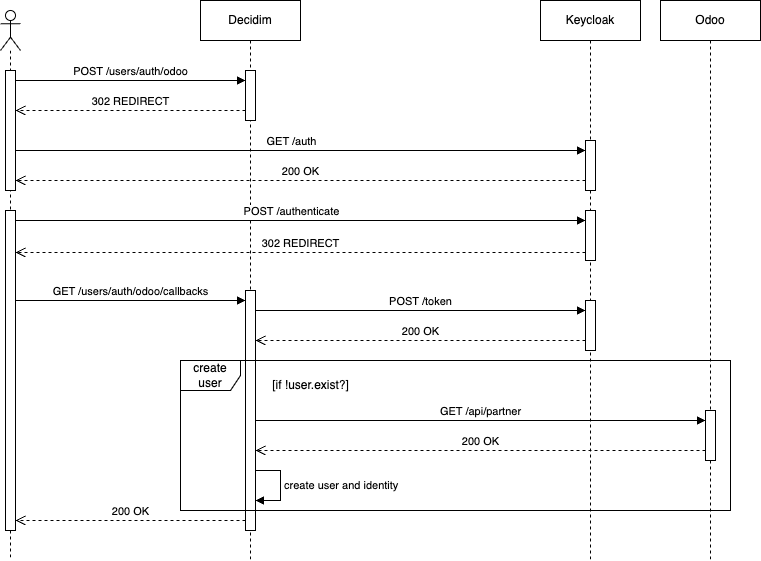

# Decidim::Odoo

[![[CI] Lint](https://github.com/Platoniq/decidim-module-odoo/actions/workflows/lint.yml/badge.svg)](https://github.com/Platoniq/decidim-module-odoo/actions/workflows/lint.yml)
[![[CI] Test](https://github.com/Platoniq/decidim-module-odoo/actions/workflows/test.yml/badge.svg)](https://github.com/Platoniq/decidim-module-odoo/actions/workflows/test.yml)
[](https://codeclimate.com/github/Platoniq/decidim-module-odoo/maintainability)
[](https://codecov.io/gh/Platoniq/decidim-module-odoo)

A Decidim module to sync Odoo users who connect to the platform using Keycloak OpenID OAuth.

This module allows the user to sign up in Decidim using the Odoo data. The process is described below:



## Installation

Add this line to your application's Gemfile:

```ruby
gem "decidim-odoo", git: "https://github.com/Platoniq/decidim-module-odoo", branch: "main"
```

And then execute:

```bash
bundle
```

## Configuration

In order to make the Odoo OAuth method with Keycloak available you need to add to your
`config/secrets.yml` the entry below:

```yaml
  omniauth:
    odoo_keycloak:
      enabled: true
      icon_path: media/images/odoo_logo.svg
```

The rest of the configuration can be done with an initializer file as the ones in
[this directory](lib/generators/decidim/odoo/templates) or with environment variables:

| ENV                                   | Description                                                                                                                                                                                                           | Example                       |
|---------------------------------------|-----------------------------------------------------------------------------------------------------------------------------------------------------------------------------------------------------------------------|-------------------------------|
| OMNIAUTH_ODOO_KEYCLOAK_CLIENT_ID     | The Keycloak client ID                                                                                                                                                                                                | `your-client-id`              |
| OMNIAUTH_ODOO_KEYCLOAK_CLIENT_SECRET | The Keycloak client secret                                                                                                                                                                                            | `your-client-secret`          |
| OMNIAUTH_ODOO_KEYCLOAK_SITE          | The Keycloak site                                                                                                                                                                                                     | `https://example.org/oauth`   |
| OMNIAUTH_ODOO_KEYCLOAK_REALM         | The Keycloak realm                                                                                                                                                                                                    | `example-realm`               |
| OMNIAUTH_ODOO_KEYCLOAK_ICON_PATH     | **Optional**. The icon path for the "Sign in with Odoo" button. In order to replace the default one, you need to include it under `app/packs/images` directory and reference it here as `media/images/your-icon.svg` | `media/images/odoo_logo.svg` |
| ODOO_API_BASE_URL                    | The base URL for the Odoo API                                                                                                                                                                                        | `https://example.org/api`     |
| ODOO_API_API_KEY                     | The API key to authenticate with the API                                                                                                                                                                              | `your-api-key`                |

## Contributing

See [Decidim](https://github.com/decidim/decidim).

### Developing

To start contributing to this project, first:

- Install the basic dependencies (such as Ruby and PostgreSQL)
- Clone this repository

Decidim's main repository also provides a Docker configuration file if you
prefer to use Docker instead of installing the dependencies locally on your
machine.

You can create the development app by running the following commands after
cloning this project:

```bash
$ bundle
$ DATABASE_USERNAME=<username> DATABASE_PASSWORD=<password> bundle exec rake development_app
```

Note that the database user has to have rights to create and drop a database in
order to create the dummy test app database.

Then to test how the module works in Decidim, start the development server:

```bash
$ cd development_app
$ DATABASE_USERNAME=<username> DATABASE_PASSWORD=<password> bundle exec rails s
```

In case you are using [rbenv](https://github.com/rbenv/rbenv) and have the
[rbenv-vars](https://github.com/rbenv/rbenv-vars) plugin installed for it, you
can add the environment variables to the root directory of the project in a file
named `.rbenv-vars`. If these are defined for the environment, you can omit
defining these in the commands shown above.

#### Code Styling

Please follow the code styling defined by the different linters that ensure we
are all talking with the same language collaborating on the same project. This
project is set to follow the same rules that Decidim itself follows.

[Rubocop](https://rubocop.readthedocs.io/) linter is used for the Ruby language.

You can run the code styling checks by running the following commands from the
console:

```
$ bundle exec rubocop
```

To ease up following the style guide, you should install the plugin to your
favorite editor, such as:

- Atom - [linter-rubocop](https://atom.io/packages/linter-rubocop)
- Sublime Text - [Sublime RuboCop](https://github.com/pderichs/sublime_rubocop)
- Visual Studio Code - [Rubocop for Visual Studio Code](https://github.com/misogi/vscode-ruby-rubocop)

### Testing

To run the tests run the following in the gem development path:

```bash
$ bundle
$ DATABASE_USERNAME=<username> DATABASE_PASSWORD=<password> bundle exec rake test_app
$ DATABASE_USERNAME=<username> DATABASE_PASSWORD=<password> bundle exec rspec
```

Note that the database user has to have rights to create and drop a database in
order to create the dummy test app database.

In case you are using [rbenv](https://github.com/rbenv/rbenv) and have the
[rbenv-vars](https://github.com/rbenv/rbenv-vars) plugin installed for it, you
can add these environment variables to the root directory of the project in a
file named `.rbenv-vars`. In this case, you can omit defining these in the
commands shown above.

## License

This engine is distributed under the [GNU AFFERO GENERAL PUBLIC LICENSE](LICENSE-AGPLv3.txt).
